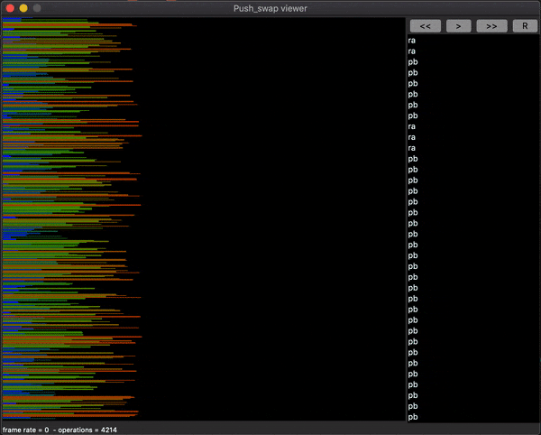

# push_swap

```
FINAL GRADE: 115/100 (2x 125 + 1x 96)
```

## ALGO

We push (pb) in B until there are only three elements left in A or we rotate (ra) the first element and push (pb) the top element if it is bigger, otherwise we rotate (ra), depending on which option will keep the most elements in A. We sort A. As long as B is not empty, we look for the element of B that will require the least number of instructions to reach A (in the right place). We rotate A and B (r{a/b/r}, rr{a/b/r} according to the shortest) to place the element in question on top of B and to be able to push it.
At the end we rotate A (ra or rra according to the shortest) to put the smallest element on top.

Visualizer : [https://github.com/o-reo/push_swap_visualizer](https://github.com/o-reo/push_swap_visualizer)



## SCORE

It has ben tested with the scros tester : [https://github.com/SimonCROS/push_swap_tester.git](https://github.com/SimonCROS/push_swap_tester.git)

```
Stack size 3 (goal : 3 OK):
	worst	: 2
	average	: 1
	best	: 0
Stack size 5 (goal : 12 OK):
	worst	: 11
	average	: 7
	best	: 0
Stack size 100 (goal : 700 KO):
	worst	: 701
	average	: 603
	best	: 491
Stack size 500 (goal : 5500 KO):
	worst	: 5832
	average	: 5468
	best	: 5104
```

Subject dated January 2022.
